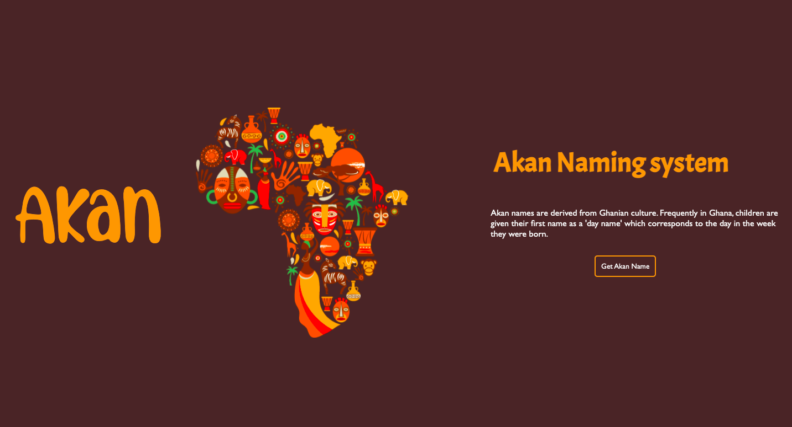

# Akan Name Generator Site
#### 04/03/2022
This is a basic html/css website that enables users to genereate their Akan Names
#### By 
Geoffrey Gichaga .G

## Table of Content

+ [Description](#description)
+ [Installation Requirement](#Installation)
+ [Known Bugs](#Known-Bugs)
+ [Technology Used](#technology-used)
+ [Support and Contact Details](#Support-and-contact-details)
+ [Authors Info](#author-Info)

## Description
This is a site that gives the user their Akan Name based on the day they were born and their Gender.
Akan Names are derived from the Ghananian culture .Frequently in Ghana,children are given their first names as a 'day name' which corresponds to the day of the week they were born.
Here is a list of the Akwan Names

Akan Names for Males :

Sunday: Kwasi
  Monday: Kwadwo
  Tuesday: Kwabena
 Wednesday: Kwaku
 Thursday:  Yaw
 Friday: Kofi
 Saturday: Kwame

Akan Names for FemaleS :

Sunday: Akosua
  Monday: Adwoa
  Tuesday: Abenaa
 Wednesday: Akua
 Thursday:  Yaa
 Friday: Afua
 Saturday: Ama

 

## How the Site Works
* User Enters their Birthday
* The System calculates and Finds the day user was born.
* It matches the day with the available name basing on the gender of the user.
* An Akan Name is then Displayed on the screen.

## Desktop mode display:
### LandingPage

### Form Section 

 

## Setup/Installation Requirements
* SIte can be accessed through the repo live link on the About Section
* A phone .tablet or a desktop computer
* Site is responsive to screens of upto 1200px

## Known Bugs
There are no known bugs ,if you spot one please dont hesitate to inform me.
## Technologies Used
Languages used in developing this site include:
* HTML 
* CSS
* Javascript
## Support and contact details
You can report any issue you encounter with the site on [Email](geoffrey.githinji@student.moringaschool.com)

### Copyright (c) {year}
copyright (c) 2022.All rights reserved.

## Authors Info
LinkedIn - [Geoffrey Gichaga .G](https://www.linkedin.com/in/geoffrey-gichaga-234318ba/)

